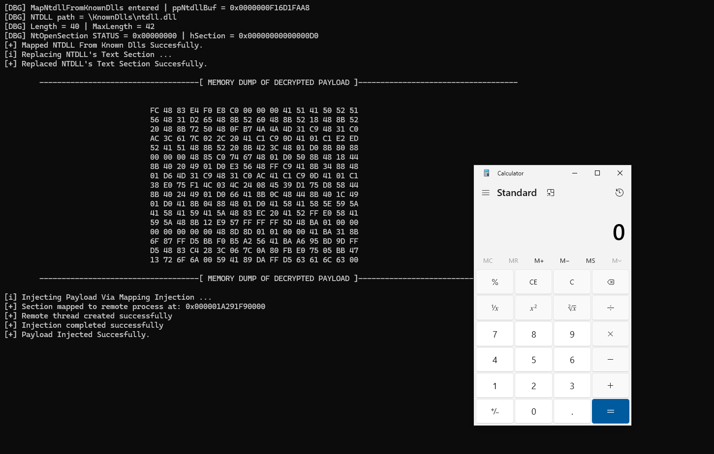

  

# Loader-Demo

## What This Project Demonstrates

This project demonstrates hands-on experience with:

- Windows user-mode internals and PE loading concepts
- Low-level API resolution and syscall invocation
- Understanding of EDR / AV userland monitoring surfaces
- Secure handling of in-memory data and obfuscation techniques
- Writing CRT-free, minimal Windows binaries

- ## Defensive Relevance

The techniques demonstrated here are commonly discussed in the context of offensive tooling,
but understanding them is critical for:

- EDR detection engineering
- Malware analysis and reverse engineering
- Windows security research

**Windows internals–focused loader demo built with low-level C**
The term “loader” is used here in an academic sense to describe PE loading and execution mechanisms.

Loader-Demo is a Windows user-mode research project developed for **educational and demonstration purposes**.  
The project focuses on exploring **low-level Windows internals**, process interaction mechanisms, and loader-related techniques in a controlled, non-operational context.

This repository is intended to demonstrate understanding of advanced Windows concepts and is **not designed for real-world deployment**.

---

## Features

- ChaCha20-based payload encryption mixed with UUID obfuscation
- IAT hiding and import camouflage techniques
- Direct system calls using **Hell’s Gate–style** syscall resolution
- Custom API resolution using **Jenkins One-At-A-Time (32-bit)** hashing
- NTDLL unhooking via clean **KnownDll** mapping
- CRT-free binary (custom implementations, no MSVCRT dependency)

---

## Build / Compilation

### Requirements

- **Windows 10 x64** (tested on 22H2 / Build 19045)
- **Visual Studio 2022**
  - Desktop development with C++
  - MSVC v143 toolset
  - Windows 10 / 11 SDK

### Build Configuration

- **Platform:** x64  
- **Configuration:** Release (recommended)

Debug builds are supported but include verbose output.

### Required Source Files

⚠️ **The project will NOT compile unless the following files are present:**

- `ChaCha20.c`
- `ChaCha20.h`
- `Structs.h`
- -`hells.asm`

These files contain:
- The ChaCha20 implementation used for payload decryption
- Core Windows internal structures and definitions required by the loader

Make sure all of these files are included in the Visual Studio project and **not excluded from build**.

### Build Steps (Visual Studio)

1. Open the solution file in **Visual Studio 2022**
2. Set configuration to **Release | x64**
3. Ensure all required source/header files are present
4. Build the project.

### Notes

- The project is intentionally **CRT-free**  
  Do not enable MSVCRT or additional runtime dependencies.
- Removing or excluding `ChaCha20.c`, `ChaCha20.h`, `hells.asm` or `Structs.h` will result in compilation or linker errors.
- The demo payload used is non-operational (Calculator) and intended purely for demonstration.

---

## Disclaimer

This repository is intended solely for educational and security research purposes.
It demonstrates Windows internals and low-level programming concepts and is not intended for real-world deployment or malicious use.

---

## License

This project is licensed under the **MIT License**.  
See the `LICENSE` file for details.
